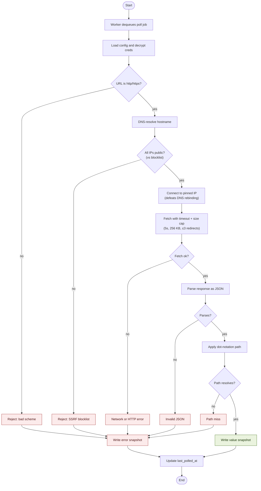
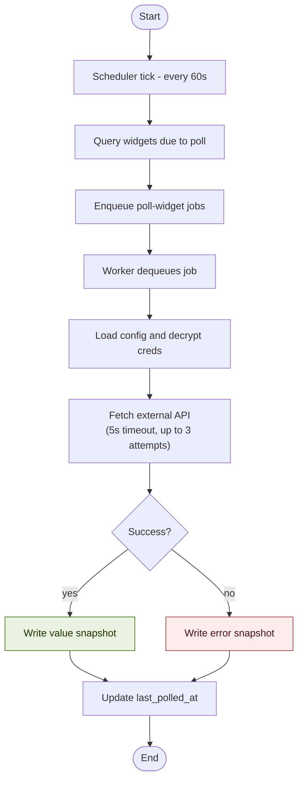
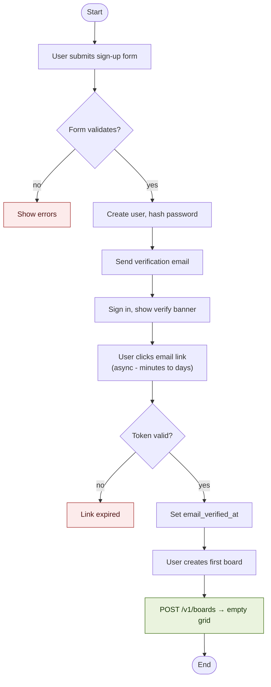
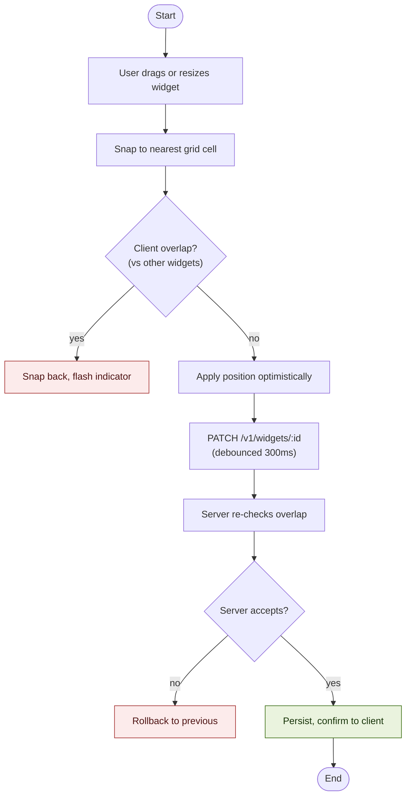

## Custom JSON widget poll with SSRF gate

```mermaid
flowchart TD
    Start([Start]) --> Dequeue[Worker dequeues poll job]
    Dequeue --> Load[Load config and decrypt creds]
    Load --> Scheme{URL is http/https?}
    Scheme -->|no| BadScheme[Reject: bad scheme]:::err
    Scheme -->|yes| Resolve[DNS-resolve hostname]
    Resolve --> Public{"All IPs public?<br/>(vs blocklist)"}
    Public -->|no| Blocked[Reject: SSRF blocklist]:::err
    Public -->|yes| Pin["Connect to pinned IP<br/>(defeats DNS rebinding)"]
    Pin --> Fetch["Fetch with timeout + size cap<br/>(5s, 256 KB, ≤3 redirects)"]
    Fetch --> FetchOk{Fetch ok?}
    FetchOk -->|no| NetErr[Network or HTTP error]:::err
    FetchOk -->|yes| Parse[Parse response as JSON]
    Parse --> ParseOk{Parses?}
    ParseOk -->|no| BadJson[Invalid JSON]:::err
    ParseOk -->|yes| Apply[Apply dot-notation path]
    Apply --> PathOk{Path resolves?}
    PathOk -->|no| PathMiss[Path miss]:::err
    PathOk -->|yes| WriteValue[Write value snapshot]:::ok

    BadScheme --> WriteError[Write error snapshot]:::err
    Blocked --> WriteError
    NetErr --> WriteError
    BadJson --> WriteError
    PathMiss --> WriteError

    WriteValue --> Update[Update last_polled_at]
    WriteError --> Update
    Update --> End([End])

    classDef ok fill:#EAF3DE,stroke:#3B6D11,color:#173404
    classDef err fill:#FCEBEB,stroke:#A32D2D,color:#501313
```

## Server-poll scheduler and worker lifecycle

```mermaid
flowchart TD
    Start([Start]) --> Tick[Scheduler tick - every 60s]
    Tick --> Query[Query widgets due to poll]
    Query --> Enqueue[Enqueue poll-widget jobs]
    Enqueue --> Dequeue[Worker dequeues job]
    Dequeue --> Load[Load config and decrypt creds]
    Load --> Fetch["Fetch external API<br/>(5s timeout, up to 3 attempts)"]
    Fetch --> Success{Success?}
    Success -->|yes| WriteValue[Write value snapshot]:::ok
    Success -->|no| WriteError[Write error snapshot]:::err
    WriteValue --> Update[Update last_polled_at]
    WriteError --> Update
    Update --> End([End])

    classDef ok fill:#EAF3DE,stroke:#3B6D11,color:#173404
    classDef err fill:#FCEBEB,stroke:#A32D2D,color:#501313
```

## Sign-up, email verification, and first board

```mermaid
flowchart TD
    Start([Start]) --> Submit[User submits sign-up form]
    Submit --> Validate{Form validates?}
    Validate -->|no| Errors[Show errors]:::err
    Validate -->|yes| Create[Create user, hash password]
    Create --> SendEmail[Send verification email]
    SendEmail --> SignIn[Sign in, show verify banner]
    SignIn --> Wait["User clicks email link<br/>(async - minutes to days)"]
    Wait --> TokenValid{Token valid?}
    TokenValid -->|no| Expired[Link expired]:::err
    TokenValid -->|yes| Verify[Set email_verified_at]
    Verify --> CreateBoard[User creates first board]
    CreateBoard --> Persist[POST /v1/boards → empty grid]:::ok
    Persist --> End([End])

    classDef ok fill:#EAF3DE,stroke:#3B6D11,color:#173404
    classDef err fill:#FCEBEB,stroke:#A32D2D,color:#501313
```

## Widget drag and resize with overlap rejection

```mermaid
flowchart TD
    Start([Start]) --> Drag[User drags or resizes widget]
    Drag --> Snap[Snap to nearest grid cell]
    Snap --> ClientCheck{"Client overlap?<br/>(vs other widgets)"}
    ClientCheck -->|yes| SnapBack[Snap back, flash indicator]:::err
    ClientCheck -->|no| Optimistic[Apply position optimistically]
    Optimistic --> Patch["PATCH /v1/widgets/:id<br/>(debounced 300ms)"]
    Patch --> ServerCheck[Server re-checks overlap]
    ServerCheck --> Accept{Server accepts?}
    Accept -->|no| Rollback[Rollback to previous]:::err
    Accept -->|yes| Confirm[Persist, confirm to client]:::ok
    Confirm --> End([End])

    classDef ok fill:#EAF3DE,stroke:#3B6D11,color:#173404
    classDef err fill:#FCEBEB,stroke:#A32D2D,color:#501313
```
