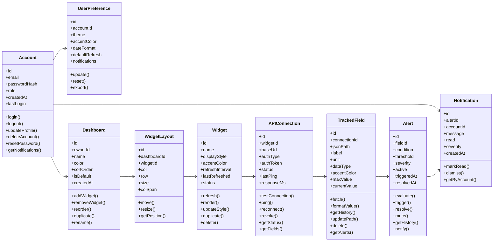

```mermaid
classDiagram
  direction LR

  class Account {
    +id
    +email
    +passwordHash
    +role
    +createdAt
    +lastLogin
    +login()
    +logout()
    +updateProfile()
    +deleteAccount()
    +resetPassword()
    +getNotifications()
  }

  class UserPreference {
    +id
    +accountId
    +theme
    +accentColor
    +dateFormat
    +defaultRefresh
    +notifications
    +update()
    +reset()
    +export()
  }

  class Dashboard {
    +id
    +ownerId
    +name
    +color
    +sortOrder
    +isDefault
    +createdAt
    +addWidget()
    +removeWidget()
    +reorder()
    +duplicate()
    +rename()
  }

  class WidgetLayout {
    +id
    +dashboardId
    +widgetId
    +col
    +row
    +size
    +colSpan
    +move()
    +resize()
    +getPosition()
  }

  class Widget {
    +id
    +name
    +displayStyle
    +accentColor
    +refreshInterval
    +lastRefreshed
    +status
    +refresh()
    +render()
    +updateStyle()
    +duplicate()
    +delete()
  }

  class APIConnection {
    +id
    +widgetId
    +baseUrl
    +authType
    +authToken
    +status
    +lastPing
    +responseMs
    +testConnection()
    +ping()
    +reconnect()
    +revoke()
    +getStatus()
    +getFields()
  }

  class TrackedField {
    +id
    +connectionId
    +jsonPath
    +label
    +unit
    +dataType
    +accentColor
    +maxValue
    +currentValue
    +fetch()
    +formatValue()
    +getHistory()
    +updatePath()
    +delete()
    +getAlerts()
  }

  class Alert {
    +id
    +fieldId
    +condition
    +threshold
    +severity
    +active
    +triggeredAt
    +resolvedAt
    +evaluate()
    +trigger()
    +resolve()
    +mute()
    +getHistory()
    +notify()
  }

  class Notification {
    +id
    +alertId
    +accountId
    +message
    +read
    +severity
    +createdAt
    +markRead()
    +dismiss()
    +getByAccount()
  }

  Account --> UserPreference
  Account --> Dashboard
  Account --> Notification
  Dashboard --> WidgetLayout
  WidgetLayout --> Widget
  Widget --> APIConnection
  APIConnection --> TrackedField
  TrackedField --> Alert
  Alert --> Notification
```
