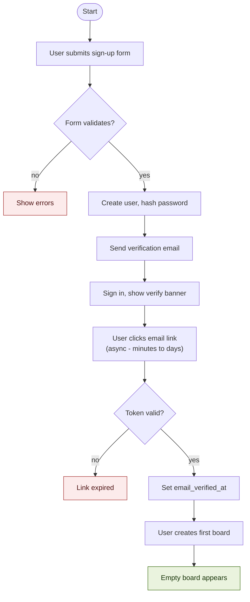
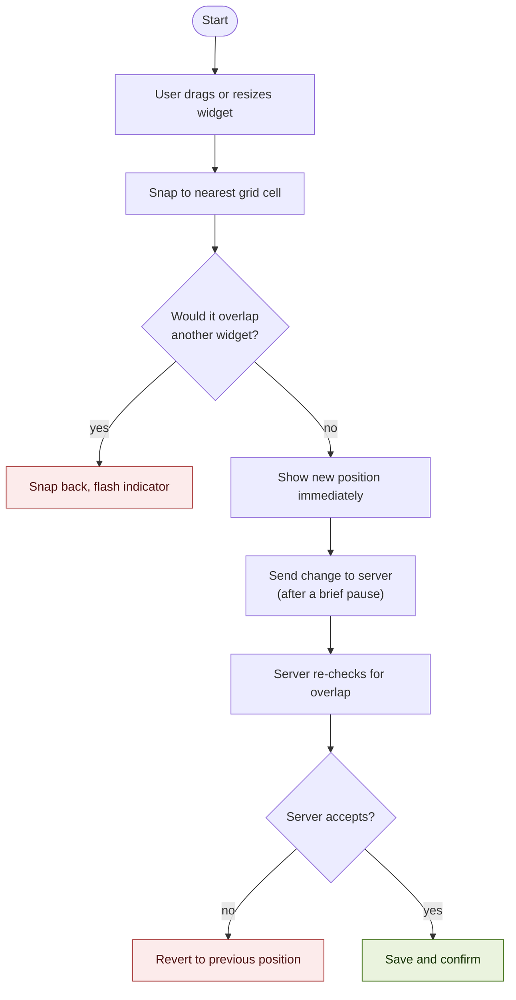
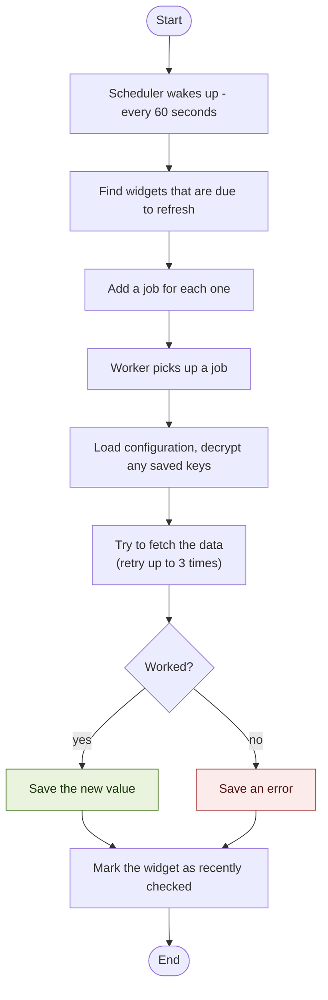
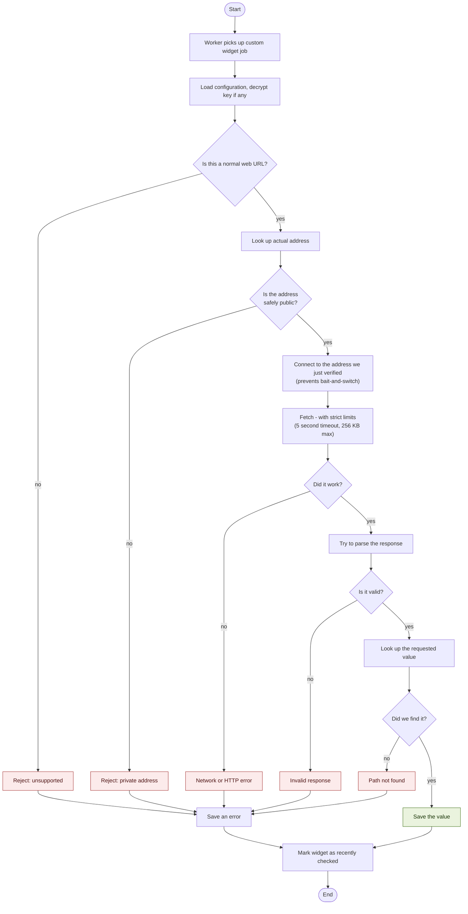

This page traces what actually happens behind the scenes during four common operations. Each one is illustrated with a flowchart. If you've never read a flowchart before, the convention is simple: each box is a step, arrows show the order, and diamonds are decision points where the path forks.

## When you create your account

**What you're looking at:** The path from "I just typed in my email" to "I have an empty dashboard ready to use." The interesting wrinkle is that you can use the app *before* you click the verification link in your email - we just show a banner asking you to verify when you have a moment. Verification only becomes mandatory if you later need to reset a forgotten password.

## When you drag a widget around

**What you're looking at:** What happens between you releasing a drag and the new position being permanently saved. There are two checks for overlap - once in your browser, then again on our server. The browser check is for speed (you get an instant "no, that doesn't fit" without having to wait). The server check is for correctness, in case something gets out of sync (for instance, if you have the same board open in two browser tabs and dragged something in the other tab a moment ago). The server is the source of truth; the browser is just a fast preview.

## When the worker fetches data

**What you're looking at:** The basic rhythm of the worker. Every minute, it asks: which widgets are due for a refresh? It then fetches data for each of them. Notice that whether the fetch succeeds or fails, we mark the widget as "recently checked." That's important - without it, a widget that's failing would get re-tried over and over in a tight loop. By recording every attempt, even the failed ones, we ensure that a misbehaving data source gets the same polite spacing as a healthy one.

## When the worker fetches a custom widget

The custom widget is special because the URL comes from the user, so we have to be careful. Here's the same fetching process with all the extra safety checks shown:

**What you're looking at:** Every place this flowchart can fail (the red boxes) is a deliberate safety check. Some are about the URL being valid. Some are about the response being parseable. The two especially important ones - *Is the address safely public?* and *Connect to the address we just verified* - are the protection against the SSRF attacks we explained on the [Keeping Your Data Safe](/design/how-it-works-keeping-data-safe/) page.

Notice that no matter how a fetch goes - success or any of the various failure modes - the widget always ends up at "Mark widget as recently checked." This is the same point we made on the previous diagram: we want a failing widget to wait its full hour before being tried again, just like a healthy one. Without that, a broken widget would get re-fetched constantly.
