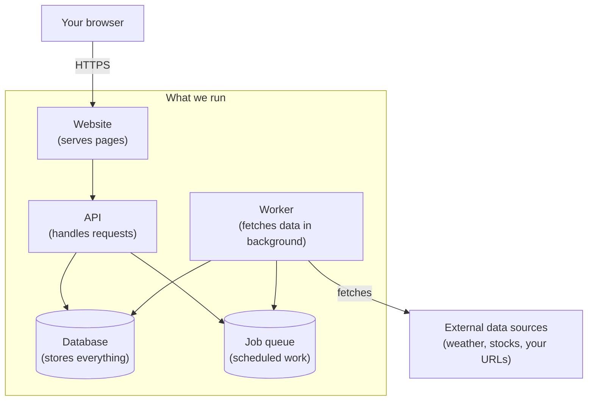

This page explains how the system fits together at a high level. We've kept it free of jargon where possible, and defined any necessary terms inline.

## The big picture

When you visit the site, your browser is talking to one of three programs we run. Each program has a focused job. They share a single database where everything is stored.

## What each piece does

**The website** is what loads in your browser. It draws the pages, handles your clicks and drags, and sends your changes back to the API. It doesn't know anything about widgets or data on its own; it asks the API for everything.

**The API** is the brain. When you log in, when you create a board, when you move a widget around - those all go through the API. It checks who you are, validates what you're asking for, and saves it to the database. It's the only piece that the website actually talks to.

**The worker** runs quietly in the background, doing scheduled work. Every minute, it checks: which widgets are due to fetch new data? Then it goes and fetches that data, stores it, and waits for the next minute. The user never interacts with the worker directly. It exists so that fetching data - which can be slow - never blocks anything you're trying to do.

**The database** is where everything is permanently stored: your account, your boards, your widget configurations, the historical data we've collected. We use a well-established database called PostgreSQL.

**The job queue** is a smaller, faster store that tracks "things the worker needs to do." When the API decides that a widget should be refreshed right now, it adds a job to the queue. The worker picks up jobs in order. We use a system called Redis for this.

## Why three programs instead of one?

It would be simpler to put everything in one program. We chose three for two reasons.

**Reliability.** If the worker is busy fetching data from a slow external service, that shouldn't make the website feel sluggish for you. Separating them means a slow fetch doesn't slow down a button click.

**Clarity.** Each program has one job. When something goes wrong, we know which one to look at. When we're adding a feature, we know which one to change.

## Where it all runs

Everything runs on a hosting platform called **Railway**. Railway gives us a place to deploy our programs, manages the database and the job queue for us, and handles the work of putting everything on the public internet. Choosing a managed platform meant we could spend more time on building the product and less time managing servers - a deliberate trade-off appropriate for a 20-week project.

## What this means for you as a user

From your point of view, none of this matters. You go to a website, you log in, you build your dashboard. The complexity is hidden - which is exactly the point.

It matters for *us* because the structure influences a lot of decisions you'll see referenced elsewhere in this wiki: how we keep your data isolated from other users' data ([Keeping Your Data Safe](/design/how-it-works-keeping-data-safe/)), how widgets actually fetch their data on schedule ([Data Flow Walkthroughs](/design/how-it-works-data-flow-walkthroughs/)), and why some widgets update faster than others ([The Widget System](/design/how-it-works-widget-system/)).
